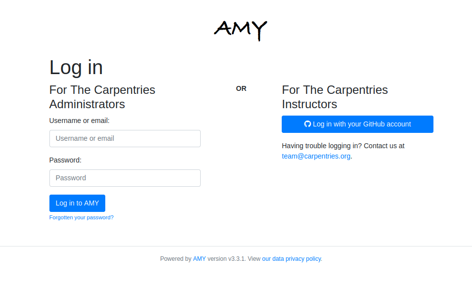
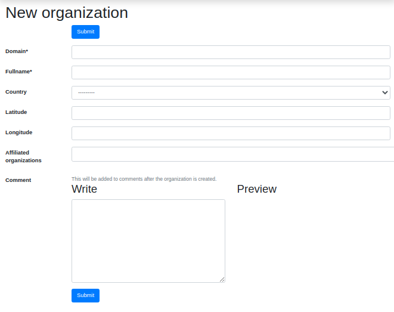
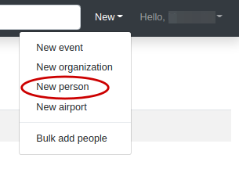
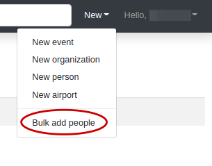
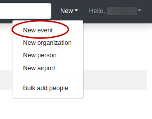
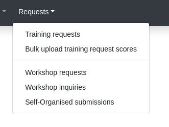
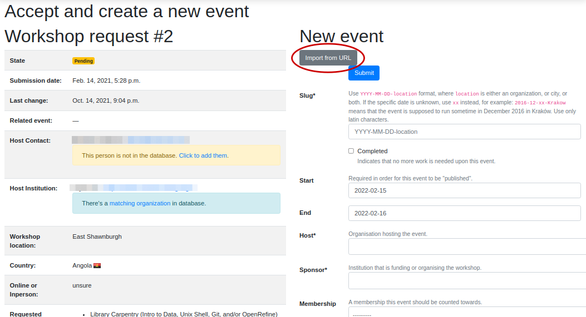
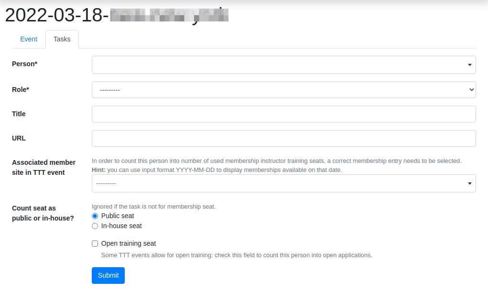
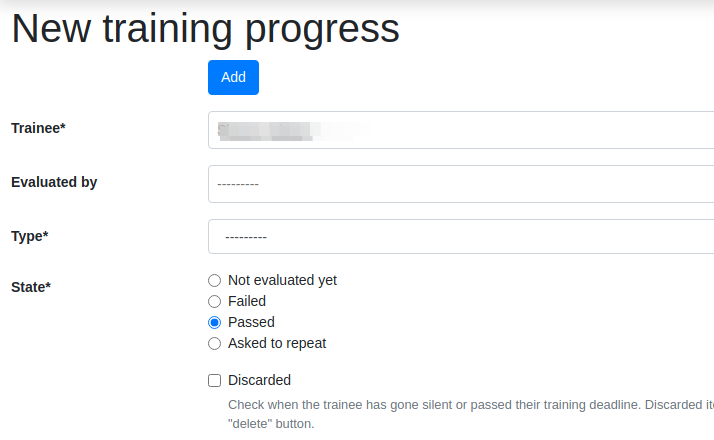
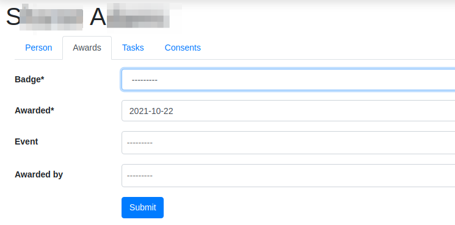

## AMY: The Carpentries' internal database

### Logging in

* Log in to AMY [here](https://amy.carpentries.org). Administrative users may log in via GitHub or a user id.  Instructors should log in via GitHub.  Contact [The Carpentries Core Team](mailto:team@carpentries.org) if you have difficulty logging in.

### AMY Dashboard

All menus and a search bar are displayed across the top. The main page has two columns, showing current workshops and in progress workshops.  This view can be filtered to show workshops assigned to the logged in administrator, another administrator, or unassigned workshops.

* *Current workshops* have a complete start and end date, a valid url, and a complete location.
* *In progress workshops* are all workshops that do not meet these criteria.

Current Data, Library, and Software Carpentry workshops will be listed on The Carpentries website, the corresponding lesson program website, and The Carpentries data feeds if the box to publish the workshop is checked.  Instructor Training events are not publicly listed.

From here you can also add new [persons](#adding-a-new-person), [events](#adding-a-new-event), [organisations](#adding-a-new-organisation), or [airports](#adding-a-new-airport) to the database.

### Adding a New Organisation

If an organisation is not already in AMY, add a new one by selecting "New Organisation."  Domain and Full Name are required fields.  Enter in the domain (full website, such as `https://www.example.com/library`).  When known, enter in the country and latitude/longitude of the main location.  There is also a text box for open ended comments.

The "Affiliated Organization" field is not being used; always leave this blank.

### Adding a New Membership

AMY is also used to track all Carpentries memberships.  To create a new membership, the site must first be listed as an [organisation](#adding-a-new-organisation) in AMY.

Select "Memberships" from the top menu bar to view a [list of all Memberships](https://amy.carpentries.org/fiscal/memberships/). Memberships can be searched by Organisation name, Consortium status, Public/Private listing, Variant, Contribution type, Active status, and allowed or remaining training seats.

New Memberships can be created one of two ways:

* If this is an entirely new membership, click on the "New Membership" button at the top of the [membership page](https://amy.carpentries.org/fiscal/memberships/). This will take you to a blank new membership form.

* If this is a [renewal of a current membership](#renewing-memberships), select that membership and click on the green "Create new & roll-over button" at the bottom of that page.  This will take you to a new membership form with some information pre-populated.

The following fields are included in the Member view:

* **Name** The name of the membership.  If this is a single organisation, it will be that organisation's name.  If it is a consortium of several organisations, it will be their collective name.
* **Consortium**  If this box is checked, you will be able to assign multiple organisations to that membership.  If not, you will only be able to assign one organisation to that membership.
* **Can this membership be publicized on The Carpentries websites** If Public is selected, the membership will be listed on [The Carpentries Members page](https://carpentries.org/members/) and [data feeds](https://feeds.carpentries.org/all_public_memberships.json).  If Private is selected, it will not be listed.
* **Variant** This lists all the membership levels (Gold, Silver, Bronze, etc.)
* **Agreement start** and **Agreement end** Start and end dates of the membership agreement.  A notification displays if the membership is not approximately one year long.
* **Extensions** Extensions are created using the "Extend" button at the bottom of the main membership page. The duration of the extension can be edited here.
* **Contribution type** What the member contribution was (Financial, Person-days, or other)
* **Registration code** A unique registration code used to unlock [Instructor Training registration in Eventbrite](https://carpentries.github.io/instructor-training/training_calendar/index.html) and match up the trainee's application to this membership. These are not automated. Eventbrite registration is manually set up within Eventbrite. Instructor training applications using the member code are [manually matched to this member and a training event](#accepting-trainee-applications).
* **Link to member agreement** Link to the Google Drive folder with the member agreement.
* **Workshops without admin fee per agreement** Number of workshops allowed in the terms of the agreement.
* **Public instructor training seats** Number of public instructor training seats allowed in the terms of the agreement.
* **Additional public instructor training seats** Number of additional public seats the member may have purchased beyond the standard agreement.
* **In-house instructor training seats** Number of in-house instructor training seats allowed in the terms of the agreement. This will typically only apply to Platinum memberships.
* **Additional in-house instructor training seats**  Number of additional in-house seats the member may have purchased beyond the standard agreement.  This will typically only apply to Platinum memberships.
* **Emergency contact** Free text field to fill in emergency contact information.

#### Consortium Memberships

If *Consortium* is checked, additional affiliated sites can be added to that membership.  These will display in the `Organisations (members)` line of the Member view. For single-site memberships, only the main site can be listed here.  For consortium memberships, additional member sites can be added in.  These sites must first be [listed as an organisation in AMY](#adding-a-new-organisation).

#### Membership Contacts

Once a new membership has been created, contact people can be assigned to the membership.  Contact people can have one of two roles:

* **Billing Contact** Person responsible for contracts and invoicing.
* **Programmatic Contact** Person responsible for coordination of workshops and instructor training

When a new membership is created, a new field called `Persons` will display. Click `Edit` in this row to add or edit any contacts. Multiple contacts can have the same role; one contact can have both roles. Existing contacts will be listed here. These Persons must first be [listed as a Person in AMY](#adding-a-new-person).

#### Extending membership dates

If a membership is granted an extension to the membership date terms, do not change the original membership end date.  Instead, click the gray "Extend" button at the bottom of the membership view. Enter in the new membership end date.  The number of days of the extension will automatically be calculated.  Add in any comments, such as the context for the extension or a link to more information. Multiple extensions can be granted. The duration of the extension can be edited in the membership's edit view.  If a second extension is granted, do not edit the original. Instead, click on the gray "Extend" button again to enter in another extension.

  

#### Renewing memberships

When a member site renews a membership, do not create a new member record. Instead, click the green "Create new & roll-over" button at the bottom of the membership view. A new member view will appear, with the following fields pre-populated. Any of these values can be edited.  A membership can be rolled over only once.

* **Name**: Same as previous
* **Can this membership be publicized?**: Same as previous
* **Variant**: Same as previous
* **Agreement start** and **Agreement end** Starts on end date of previous membership; ends one year from start
* **Contribution type**: Same as previous
* **Instructor training seats and workshops allowed**: Same as previous or standard amounts allowed for that membership

This also includes the options to automatically copy over member organisations (for consortiums only) and copy over associated persons and their roles.

The number of workshops or instructor training seats rolled over from the previous membership should be manually entered.  These workshop/instructor training seats counts will be reflected in the available counts for both the new and previous memberships.

### Adding a New Person

If a person's record does not exist in the database, it can be added individually or as part of a bulk upload.

#### Adding an Individual Person Record

Select "New person" and enter in as much information as possible.  At minimum a personal name is required.  If the airport is not listed, it will need to be [added in](#adding-a-new-airport).

#### Adding Bulk Person Records

`Person` records can also be added in bulk from a `.csv` file using the `Bulk add persons` menu option in the  `New` menu at the top right or the `More` menu. Use the blank template to generate a well formed CSV noting each person's personal name, family name (optional), email address (optional), role, and associated event. Any additional information about the person must be entered manually.  **Note: To bulk add records, the persons must have a role specified (instructor, helper, learner, host) associated with a specific event**.

The role must exactly match the [instructions here](https://amy.carpentries.org/workshops/persons/bulk_upload/). The event slug must exactly match the slug for the event recorded in AMY.

This will take you to a screen where you can verify each record, correct any errors, and submit them for bulk upload.  If a person with the same name and email already exists in the database, you will be able to match the new entry to the existing record.  Otherwise a new person record will be created.

#### Consents

AMY asks all users to consent or agree to the following:

* **I have read and agree to the data privacy policy of The Carpentries.**
* **May contact**
* **Consent to making profile public**
* **Do you consent to have your name or identity associated with lesson publications?**

By default, all consents have null values (i.e., neither yes nor no). After a Person's record has been created, the individual can log in to AMY and edit their own consents. Admin users may also make these edits on behalf of the user, but this should be used only in rare circumstances. Consents are edited in a separate tab in the Person view. 

### Adding a New Airport

Airports are used as approximate geographic identifiers for our instructors.  Instructors can self-select the airport closest to them or the airport they most frequently use. Instructors can select an airport only after it has been added to AMY by an admin.  Each airport is identified by its three character IATA code which can be looked up using [the link in AMY](https://www.world-airport-codes.com/).

Enter in the airport's IATA code, full name, country, and latitude and longitude.

### Adding a New Event

New events can be created one of several ways:

* By manually entering all information on the [new event page](#creating-a-new-event-manually)
* By importing from URL on the [new event page](#creating-a-new-event-from-url)
* By accepting a [workshop request](#creating-a-new-event-from-a-workshop-request)

#### Creating a New Event Manually

Go to the [New Event](https://amy.carpentries.org/workshops/events/add/) page by clicking on `New >> New Event` in the top right corner, or clicking on the `New Event` button on the [Events listing page](https://amy.carpentries.org/workshops/events/).

* **Slug** Create the workshop slug. This must be in the form `YYYY-MM-DD-sitename` (for example, `2018-01-01-hawkins`.  The same slug should be used for the workshop's GitHub page and any other place the workshop is identified. If the exact date is not known, `XX` can replace the month and/or day (for example, `2018-01-xx-starfleet`).

* **Workshop Dates** If known, enter in the workshop start and dates.  Do not check the "Completed" box -- this will be checked after the workshop is over and all associated wrap up work is finished.

* **Host** Select the Host name from the drop down menu. The Host is the institution where the workshop is actually being held (or would be held for online workshops). If the Host does not appear on the list, [create a new organisation](#adding-a-new-organization).

* **Sponsor** Select the Sponsor name from the drop down menu.  The Sponsor is the institution responsible for funding or organising the workshop and is often the same as the Host.

* **Membership** Select the Membership this event should be applied to, by membership term and membership dates.

* **Administrator** Select the administrator from the drop down menu.  This will always be  `Data Carpentry`, `Library Carpentry`, `Software Carpentry`,  `Instructor Training`, or `Self-Organised`.

* **Is this workshop public** If the workshop Host consents, choose "Public." This will list the workshop on the websites for The Carpentries, the associated lesson programs, and The Carpentries data feeds.  If "Private" it will not be listed publicly anywhere.

* **Assigned to** Select the name of The Carpentries team member responsible for managing this workshop.  Only AMY admin users appear in this list.  This assignment is used in the views throught AMY.

* **Event Tags**  Tags are used for several purposes as noted below, including event type, event status, lesson program, event status, and administrative attributes. Multiple tags can be selected for any event.

    - *automated-email*: Administrative. Automated emails are sent only for workshops with this tag.
    - *DC*: Lesson Program. Identifies workshops teaching from Data Carpentry curricula.
    - *LC*: Lesson Program. Identifies workshops teaching from Library Carpentry curricula.
    - *SWC*: Lesson Program. Identifies workshops teaching from Software Carpentry curricula.
    - *Circuits*: Lesson Program.  Identifies "mix and match" workshops teaching across lesson programs.
    - *online*: Administrative. Identifies workshops taking place on line.
    - *TTT*: Event type. Identifies Instructor Training events.
    - *ITT*: Event type. Identifies Trainer Training events.
    - *Pilot*: Event type. Identifies workshops teaching pilot curricula.
    - *for-profit*: Administrative. Identifies workshops run by for-profit institutions.
    - *Scholarship*: Administrative. Identifies sponsored workshops. 
    - *private-event*: Deprecated. Formerly used before explicit private/public field existed.
    - *cancelled*: Event status. Identifies workshops that got canceled after they were fully scheduled.
    - *unresponsive*: Event status. Identifies workshops whose Hosts/Instructors are not sending attendance data.
    - *stalled*: Event status. Identifies workshops where planning began but workshops did not happen.
    - *LMO*: Event type.  Identifies Lesson Maintainer Onboarding sessions (for Lesson Maintainers).
    - *LSO*: Event type.  Identifies Lesson Specific Onboarding sessions (for Instructors).
    - *hackathon*: Event type. 
    - *WiSE*: Event audience. Identifies workshops for Women in Science and Engineering.  
       

* **TTT Open applications** For instructor training events, member sites become associated with the event as individuals from that member site are assigned to that event. Checking this box will allow people from the open application pool to be matched to this event as well.  This box is automatically checked for events with the `TTT` tag.

* **Curricula taught at the workshop** Select the curricula taught at this workshop.

* **Lessons covered** *Placeholder section for lessons covered*

* **URL** Enter in the workshop's url (to the GitHub page, not the repo). This is generally in the format `https://username.github.io/YYYY-MM-DD-sitename`.  It is created using the [template in this GitHub repo](https://github.com/carpentries/workshop-template).

* **Language**  Enter in the human language the workshop is taught in. This is especially important for The Carpentries to track workshops in languages other than English.

* **Eventbrite**  If the workshop is using The Carpentries Eventbrite for registration, enter the Eventbrite key. This is not needed if the host site is using their own Eventbrite account or any other registration system.

* **Manual Attendance**   After the event is over, record the total number of learners who attended the workshop.  This is compared to the count of learner tasks at that event.  In the end, the higher value will be displayed.  Note The Carpentries does not currently maintain attendance data on its workshops.

* **Additional people to contact**  Enter only email addresses for any additional contact people for this event. This is intended for people who do not have an official role (Host, Instructor, etc.) at the workshop.  Enter emails addresses, one at a time.  These individuals do not need a Person record in AMY.  They will be included on any automated emails.

* **Location details**  Add in the location including the country, venue name, address, and latitude/longitude coordinates.

* **Comment**  Add in any other notes that may not be covered in any fields above.  This will be transformed into a timestamped notes log once the event is saved.  Comments can be formatted in Markdown.

**Click "Submit" to save this event.**  Roles such as Instructor, Host, and helper can be [assigned](#assigning-people-to-events) after the event is created and saved.

#### Creating a New Event from URL

If you already have the event's URL with properly formatted metadata using [The Carpentries workshop template](https://github.com/carpentries/workshop-template), some information can automatically be imported.  Go to the [New Event](https://amy.carpentries.org/workshops/events/add/) page by clicking on `New >> New Event` in the top right corner, or clicking on the `New Event` button on the [Events listing page](https://amy.carpentries.org/workshops/events/).  Click on the "Import from URL" button and enter the link to the workshop website OR GitHub URL.

This will automatically populate the following fields:

* Slug (created from GitHub repo name)
* Start and end dates
* Location details

Instructor and helper names will be in the notes field but not assigned in the database.  All people will need to be [assigned to the event](#assigning-people-to-events).

All other information will need to be [entered in as above](#creating-a-new-event-manually).

#### Creating a New Event from a Workshop Request

A workshop can be requested from a host site, and this information can be used to create an event in AMY. In the "Requests" menu, select one of the following options:

* Workshop requests
* Workshop inquiries
* Self-Organised submissions

This will take you to a summary view of the workshop requests, workshop inquiries, or self-organised submissions.  Click on the "information" icon at the right of each row to see more details.

At the bottom of the request information page, the user has the option to accept or discard the request. All requests should be accepted (unless spam or otherwise inappropriate) so The Carpentries can maintain a history of workshop requests. Events can later be tagged as stalled or cancelled. Choosing "Change state to Accepted" will mark it as accepted in the workshop request list but will not create a new event. Select "Accept and create a new event" to create a new event from this request. 

This will open a page with a side by side view of the request details and view to create a new event, similar to the general new event page. The new event can be created [manually](#creating-a-new-event-manually) or if available, [from the URL](#creating-a-new-event-from-url), as described above.

### Assigning People to Events

Regardless of how events are created, adding the people associated with each event can not easily be automated. [Name matching is hard](http://www.kalzumeus.com/2010/06/17/falsehoods-programmers-believe-about-names/).

People can be associated with events one by one or as a bulk upload.  The person must already [be in AMY](#adding-a-new-person) before assigning them to a role at an event.

#### Assigning People to Events, One by One

Go to the event page and click the "Edit" button at the top of the page.  Select the "Tasks" tab. 

Fill in the following fields:

* **Person** Start typing in the person's name.  Auto-completed suggested names will appear.
* **Role** Add the person's role in the event (Helper, Instructor, Supporting Instructor, Workshop Host, Learner, Workshop Organiser. Contributed to Lesson Materials is not used in this context.). 
* **Title** and **URL** are not used in this context.

If a person's name does not appear in the dropdown, they will need to be [added to the database](#adding-a-new-person).

If this is a learner role at an Instructor Training event, the following fields should also be filled in.  These fields apply only to Instructor Training, and can be left blank for other types of events.

* **Associated member site in TTT event** Note the membership (institution name and membership year) that this seat should be assigned to.
* **Count seat as public or in-house?** Note whether the learner seat should be counted as public or inhouse.  Most seats will be public. Inhouse only applies to select Platinum level memberships.
* **Open training seat** Note whether this learner came through our open program, and is not affiliated with a member site.

Click "Submit" to save your changes.

Below this form, a list of all people assigned to this event is displayed, with three options at the end of the row.

* **"i" icon** opens a detailed view of this Person's role at this event
* **pencil icon** opens an edit view of this Person's role at this event
* **red X icon** deletes this Person's role at this event

#### Assigning People to Events in Bulk

See [section above](#adding-bulk-person-records).

### Instructor Training

#### Accepting Trainee Applications

In addition to tracking workshops, AMY also allows us to track applications to instructor training events. [The public facing application is here](https://amy.carpentries.org/forms/request_training/). Applicants are given a registration code if participating in a member training event and should select "Profile Creation for Pre-approved Trainees" using this code. Open applicants will not have a registration code.

Once an individual submits the form, they receive an email that confirms their application has been received and includes a copy of the individual's responses. An admin user can then view the record by going to Requests --> [Training Requests](https://amy.carpentries.org/requests/training_requests/).

Applications can then be searched by individual name, email address, group (registration code), status (pending, accepted, discarded, or withdrawn), affiliation, or location.  Affiliation and location searches rely on text strings, so *UCLA* will not return *University of California Los Angeles* and *Joburg ZA* will not return *Johannesburg* or *South Africa*.

Some trainees will already be in AMY. If there is a record with a matching name and email address, they will show up with a "matched trainee" when you search for them. You can match the application to this trainee, or if the match was incorrect, search for a different Person record or create a new Person.

If "matched trainee" is blank, you will need to create a new person record for them.  To create a trainee record, click on the "i" icon at the far right of the individual's line. If you know this person is in AMY under a different name or email address, look this person up here and click "Match to selected trainee account."  If this is a new person, click "Create new trainee account."  This will create a new Person record for that trainee.

This will return you to the [instructor training application search screen](https://amy.carpentries.org/requests/training_requests/), and this person's record will be updated with the new trainee account.

Continue doing this until all relevant applications have a new trainee account. This must be done individually; it can not be done in bulk.

Once all trainees for a given event have trainee accounts, we can assign them to a specific training event and associate them with a specific member contract. This part can be done in bulk for each group of trainees with a unique training date and member site affiliation. The [event](#adding-a-new-event) and the [member agreement](#memberships) must already have been created in AMY.

Check all the names to be assigned to the training event and membership, and then select the training event from the first drop down menu.  Select the member agreement from the second drop down menu. If the trainees are coming through the open application process rather than a member agreement, check this box instead of choosing a member agreement.

Click "Accept & match selected trainees to chosen training." The search screen will then update to show that the trainees have been matched to this event. The event page will also update to list these trainees as learners at that event.

#### Tracking Checkout Progress

The above steps note that a trainee was accepted in to a training event. Completion of the training event and three steps towards trainee checkout can be tracked in AMY.  Each person's record will have a line for Instructor Training Progress. Hover over any item to see more information.

Click on the plus sign in the Training Progress line. This will go to a screen where you can track all the steps towards certification.

* **Trainee** Start typing in the person's name.  Auto-completed suggested names will appear.
* **Evaluated by** This will default to the current admin user.
* **Type** This will be the training event (Training), the discussion session (Discussion), the teaching demo (DC Demo, LC Demo, or SWC Demo), or the lesson contribution (DC Homework, LC Homework, SWC Homework).  The lesson contribution type requires a link to the GitHub issue or PR.
* **State** For the checkout type noted above, indicate if the trainee passed, was asked to repeat, or failed.  Failed should only be used in extreme circumstances.
* **Discarded** This field is not currently used.
* **Notes** Any free notes from the admin.

### Issuing Badges

The Carpentries has various badges that can be issued, including Data Carpentry Instructor, Software Carpentry Instructor, Trainer, Maintainer, and more.  

An individual badge can be issued by going to a person's record and clicking the `Edit` button.  Choose the `Awards` tab on the next screen.  

* **Badge** The specific badge that is being awarded
* **Awarded** The date the badge is being awarded on
* **Event** Used only if the badge was offered after an event, such as Instructor Training or Maintainer Onboarding
* **Awarded by** The admin user awarding the badge

### Reports

AMY comes with several built in reporting features that can be accessed by clicking `Reports` in the top menu.

* **Membership training statistics** Lists all memberships by variant, agreement dates, contribution type, and total/used/remaining instructor training seats (inhouse and public)
* **Workshop issues** and **Instructor issues** identify specific workshops and instructors with gaps in data.
* **Find duplicate persons** and **Find duplicate training requests** identifies Persons or Training Requests that may be listed as duplicates due to having the same name or email address, and allows the user to merge them. [Read more on how to merge duplicates](#merging-duplicate-persons-training-requests-or-events)

### User and Administrator Roles

What you are able to edit or view depends on your assigned role as a user or administrator in AMY.

#### Instructor Login

Instructors can log in to AMY to view and update their own information. To do so, they must have a valid GitHub username in their profile. Instructors should visit the [AMY login page](https://amy.carpentries.org/account/login/) and click on `Log in with your GitHub account`.

If an instructor is having trouble logging in, an administrator can verify the following information.

* Be sure the GitHub user name is accurate.
* Click on `Change permissions` and be sure `Is active` is checked. No other permissions should be checked unless the instructor is also an otherwise authorised user.
* `Logging in allowed` should show next to the GitHub name in the profile. If it says `Allow logging in with GitHub`, click this to allow logging in. This must be done **after** setting permissions to active above.

#### Admin Roles

Admin users will have rights to view and edit many other parts of the AMY database.  The Django admin panel can be accessed from the top right menu, under the user's name, generating a unique URL for the session.

An admin user can view their profile as if they were an ordinary user on [this dashboard page](https://amy.carpentries.org/dashboard/trainee/).

### Automated emails

AMY sends automated emails for workshop administration.  The following seven email automations are currently enabled.

**Email description:** Introduction of instructors and host. See [Code](https://github.com/carpentries/amy/blob/e950612ede01af06e0ca1d27293d67634036cc3c/amy/autoemails/actions.py#L703)  
**Sent to:**  All Workshop Hosts + Instructors  
**Sent from:**  Regional coordinator email  
**Subject:** Instructors for {{ workshop_main_type }} workshop organized by {{ workshop_host.fullname }}  on {{ dates }}  
**Date sent:** one hour from when conditions are met.  
*Conditions:*  Start date more than seven days in future. Not canceled/stalled/unresponsive.  Has administrator.  Has at least two instructors and at least one host. Has at least one supporting instructor if online.  CO only.  
**Content:** [View in the Django admin panel](https://amy.carpentries.org/yikoouxjewu5mri5wmqkufrq6ztk8i5y/autoemails/emailtemplate/5/change/) (authorized users only)    

**Email description:** Recruit Helpers.  See [Code](https://github.com/carpentries/amy/blob/e950612ede01af06e0ca1d27293d67634036cc3c/amy/autoemails/actions.py#L973)  
**Sent to:**  All Workshop Hosts + Instructors  
**Sent from:** Regional coordinator email (admin-xx@carpentries.org)  
**Subject:** Time to Recruit Helpers for {{ workshop_main_type }} workshop at {{ workshop.venue }}  on {{ dates }}  
**Date sent:** 21 days before first day of workshop  
**Conditions:**  Start date in future. Not canceled/stalled/unresponsive.  Has administrator.  Has at least one instructor or at least one host.  Has no helpers.  CO only.  
**Content:** [View in the Django admin panel](https://amy.carpentries.org/yikoouxjewu5mri5wmqkufrq6ztk8i5y/autoemails/emailtemplate/7/change/) (authorized users only)    

**Email description:** Website URL is missing.  See [Code](https://github.com/carpentries/amy/blob/e950612ede01af06e0ca1d27293d67634036cc3c/amy/autoemails/actions.py#L839)  
**Sent to:**  All Instructors  
**Sent from:**  Regional coordinator email  
**Subject:** Workshop Website needed for  {DC, SWC, LC} workshop at {site} on {dates}  
**Date sent:**  30 days before start date.  
**Conditions:** Start date in future. Not canceled/stalled/unresponsive.  Has administrator.  No workshop URL. At least one instructor.  CO and SO.  
**Content:** [View in the Django admin panel](https://amy.carpentries.org/yikoouxjewu5mri5wmqkufrq6ztk8i5y/autoemails/emailtemplate/6/change/) (authorized users only)    

** Soon to be deprecated:**  
**Email description:**  Supporting Instructor is added to the workshop.  See [Code](https://github.com/carpentries/amy/blob/e950612ede01af06e0ca1d27293d67634036cc3c/amy/autoemails/actions.py#L348)  
**Sent to:**  Single new supporting instructor  
**Sent from:**  Regional coordinator email  
**Subject:** Confirmation of your participation as a Supporting-Instructor for {{ workshop_main_type }} workshop organized by {{ host.fullname }} ({{ dates }})
**Date sent:**  one hour after conditions are met  
**Conditions:**  New role of supporting instructor added. Start date in future. Not canceled/stalled/unresponsive.  Has administrator.  Online workshop. CO only.  
**Content:** [View in the Django admin panel](https://amy.carpentries.org/yikoouxjewu5mri5wmqkufrq6ztk8i5y/autoemails/emailtemplate/4/change/) (authorized users only)     

**Email description:** Instructor is added to the workshop.  See [Code](https://github.com/carpentries/amy/blob/e950612ede01af06e0ca1d27293d67634036cc3c/amy/autoemails/actions.py#L256)	
**Sent to:**  Single new instructor  
**Sent from:**  Regional coordinator email  
**Subject:** Confirmation of your participation as an instructor for {{ workshop_main_type }} workshop organized by {{ host.fullname }}  ({{ dates }})  
**Date sent:** One hour after conditions are met  
**Conditions:** New role of instructor added. Start date in future. Not canceled/stalled/unresponsive.  Has administrator.  CO only.  
**Content:**  [View in the Django admin panel](https://amy.carpentries.org/yikoouxjewu5mri5wmqkufrq6ztk8i5y/autoemails/emailtemplate/1/change/) (authorized users only)   

**Email description:** A new event is created from Self-Organised Request Form.  See [Code](https://github.com/carpentries/amy/blob/e950612ede01af06e0ca1d27293d67634036cc3c/amy/autoemails/actions.py#L594)	
**Sent to:**  Form submitter and additional contacts  
**Sent from:**  Regional coordinator email  
**Subject:**  {{ workshop.host.fullname }} ({{ workshop.slug }}) Workshop  
**Date sent:** One hour after conditions are met  
**Conditions:**  Start date in future. Not canceled/stalled/unresponsive.  Event created from SO form.  SO only.  
**Content:** [View in the Django admin panel](https://amy.carpentries.org/yikoouxjewu5mri5wmqkufrq6ztk8i5y/autoemails/emailtemplate/3/change/) (authorized users only)    

**Email description:** 7 days past the end date of an active workshop.  See [Code](https://github.com/carpentries/amy/blob/e950612ede01af06e0ca1d27293d67634036cc3c/amy/autoemails/actions.py#L430)  	
**Sent to:**  All Workshop Hosts + Instructors  
**Sent from:**  Regional coordinator email  
**Subject:** Completed {{ workshop_main_type }}Carpentries workshop at {{ workshop.venue }} on {{ dates }} ({{ workshop.slug }})  
**Date sent:** 7 days after end date  
**Conditions:** End date in past.  Tag is not stalled, canceled, or unresponsive. Tag is one of ["LC", "DC", "SWC", "Circuits"].  SO and CO.  
**Content:**  [View in the Django admin panel](https://amy.carpentries.org/yikoouxjewu5mri5wmqkufrq6ztk8i5y/autoemails/emailtemplate/2/change/) (authorized users only)  

### Other Tasks

#### Merging Duplicate Persons, Training Requests, or Events

If duplicate Person, Training Request, or Event records exist, they can be merged.  Select the appropriate option from the "More" menu.

Choose the two records to be merged, and click "Submit" to see merge options. Here you can choose to keep the value from Record A, from Record B, or to combine the values.  By default, keeping the value in Record A is checked.

### Searching

#### General Search

The quickest and easiest way to search is using the search box in the top menu bar. This will perform a case insensitive search of any field in AMY, including searching for partial matches. For example:

*  `12-12-` will match any workshop slug containing that string (essentially any workshop on December 12 of any year.)
* `ola tes` will match `Nikola Tesla` and `Nolan Bates`
* `stanford` will match any one with a `stanford` email address, with `stanford` in their name, any workshops with `stanford` in the slug, or the site `Stanford University`.

If only one result is found across all fields, AMY will automatically redirect to that result.  Otherwise, AMY will redirect to a search results view.  The search results view will include a new search box, with results appearing in a tabbed view, separated by Organisations, Memberships, Events, Persons, Airports, Training Requests, and Comments.

[This search view can also be accessed directly from the More menu](https://amy.carpentries.org/dashboard/admin/search/).

#### Searching for Qualified Instructors

Under the "More" menu, select "Find Workshop Staff."  Here you can filter by the following criteria:

* **Airport**: This returns a list of all Instructors beginning with those who list that airport as their closest airport, and then continues reaching farther out.
* **Country**: This returns a list of all Instructors who are in that country.  It does not continue to any proximate countries.
* **Latitude** and **Longitude**: Like the *Airport* search, this begins with people whose listed airport is closest to that latitude and longitude, and then continues reaching farther out.
* **Badges**: Selecting more than one Instructor badge will return a list of Instructors who have *any* of those badges. If no badge is selected, the search will return unbadged Persons.
* **Was helper at least once before**, **Was organiser at least once before**, **Is an in-progress instructor trainee** are based on AMY's current records
* **Languages**, **Knowledge Domains**, **Gender**, and **Lessons** come from the Person record for that individual.

#### Searching for Events

Clicking "Events" on the top menu bar will take you to a list of *all* recorded events - past, present, and future, including those that were stalled or cancelled. Here you can filter by the following criteria:

* **Assigned to**: The admin user the event is assigned to
* **Tags**: Any tags applied to that event
* **Host**: The organisation hosting the event
* **Administrator** The event administrator (A lesson program for centrally organised workshops, self organised, or Instructor Training)
* **Completed** Whether the "completed" box has been checked, indicating all necessary work for that event is complete
* **Country** Country from the event's location
* **Continent** Continent based on the country
* **Status** Whether the event is active, past, ongoing, upcoming, unpublished, published, detected changes in metadata
* **Ordering** Select sort order for returned list

#### Searching for Organisations

Clicking "Organisations" on the top menu bar will take you to a list of *all* recorded organisations, regardless of their involvement with The Carpentries. Here you can filter by the following criteria:

* **Country**: Country the organisation is based in
* **Memberships (current or past)**: Whether the organisation has had any current or past membership, by selected membership variant
* **Ordering** Select sort order for returned list

#### Searching for Memberships

Clicking "Memberships" on the top menu bar will take you to a list of all Carpentries memberships - past, present, and future.  Here you can filter by the following criteria:

* **Organisation Name**: For most memberships, this will be the name of the main organisation. For consortium memberships, this will be the name of the consortium.
* **Consortium**:  Whether the membership is listed as a consortium
* **Can this membership be publicized on The carpentries websites?**: Whether public/private has been selected, allowing the membership to be listed on [The Carpentries website](https://carpentries.org/members/)
* **Variant**: The membership level (bronze, silver, gold, etc.)
* **Contribution type**: Financial, Person-days, etc.
* **Only show active memberships**
* **Only show memberships with non-zero allowed training seats**
* **Only show memberships with zero or less remaining seats**
* **Ordering** Select sort order for returned list

#### Searching for Persons

Clicking "Persons" on the top menu bar will take you to a list of *all* recorded persons, regardless of their involvement with The Carpentries. Here you can filter by the following criteria:

* **Badges** This will return Persons who have any of the selected badges
* **Taught at workshops of type** This will list Persons who have taught at workshops with any of the selected tags
* **Ordering** Select sort order for returned list

 See the section above to search specifically for [qualified instructors](#searching-for-qualified-instructors).
